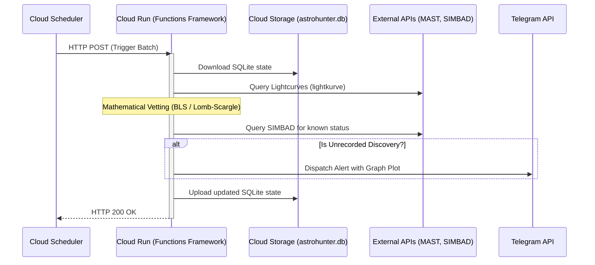

# Star Discovery Bot - Serverless Cloud Architecture

## 1. Executive Summary
This document outlines the refactoring and migration of the local Python astronomical data pipeline ("Astrohunter") to an event-driven, serverless architecture on Google Cloud Platform (GCP). The entire deployment is engineered to operate 100% within the **GCP Always Free Tier**.

## 2. Target Architecture
The system will shift from a locally-executed, long-running daemon to a transient, event-driven microservice.

### Components
1. **Google Cloud Scheduler (Automation)**
   - Acts as the cron-based heartbeat of the system.
   - Dispatches an HTTP POST request on a defined cadence (e.g., every hour).
   - Passes execution payloads (e.g., target ranges or batch sizes).
2. **Google Cloud Run (Execution Engine)**
   - A stateless, auto-scaling container environment.
   - Scaled to 0 when idle to incur absolutely $0 cost.
   - Wrapped using `functions-framework` to expose an HTTP entry point.
3. **Google Secret Manager (Security)**
   - Securely injects Telegram API keys and other sensitive credentials at runtime.
4. **Google Cloud Storage (State Persistence)**
   - Replaces local SQLite persistence. The container will pull `astrohunter.db` from a free-tier GCS bucket upon cold start, and push the updated database back to the bucket upon completion of the batch.

## 3. Data Flow

## 4. Required Code Refactoring
1. **Entry Point (`main.py`)**: Remove the `argparse` CLI loop. Wrap the execution logic inside a `@functions_framework.http` annotated function.
2. **Resiliency (`tenacity`)**: Wrap the `lightkurve` and `astroquery` calls with `@retry(wait=wait_exponential(multiplier=1, min=4, max=10), stop=stop_after_attempt(3))` to prevent transient API 502s from crashing the serverless container.
3. **State Management**: Implement a GCS fetch/push wrapper in `db.py` to persist the SQLite file across container restarts.

## 5. GCP Free Tier Limits Check
- **Cloud Run**: 2 million requests / 360,000 GB-seconds per month (Pipeline will use < 1% of this).
- **Cloud Scheduler**: 3 free jobs per month (We need 1).
- **Cloud Storage**: 5 GB-months regional storage (SQLite DB is < 10MB).
- **Secret Manager**: 6 active secret versions (We need 1).

## 6. Deployment Plan (Terraform)
We will use Infrastructure as Code (IaC) via Terraform to provision the environment cleanly:
- Enable necessary GCP APIs (`run.googleapis.com`, `cloudscheduler.googleapis.com`, etc.).
- Provision a Service Account with minimal IAM roles.
- Deploy the Cloud Run service.
- Deploy the Cloud Scheduler job.
